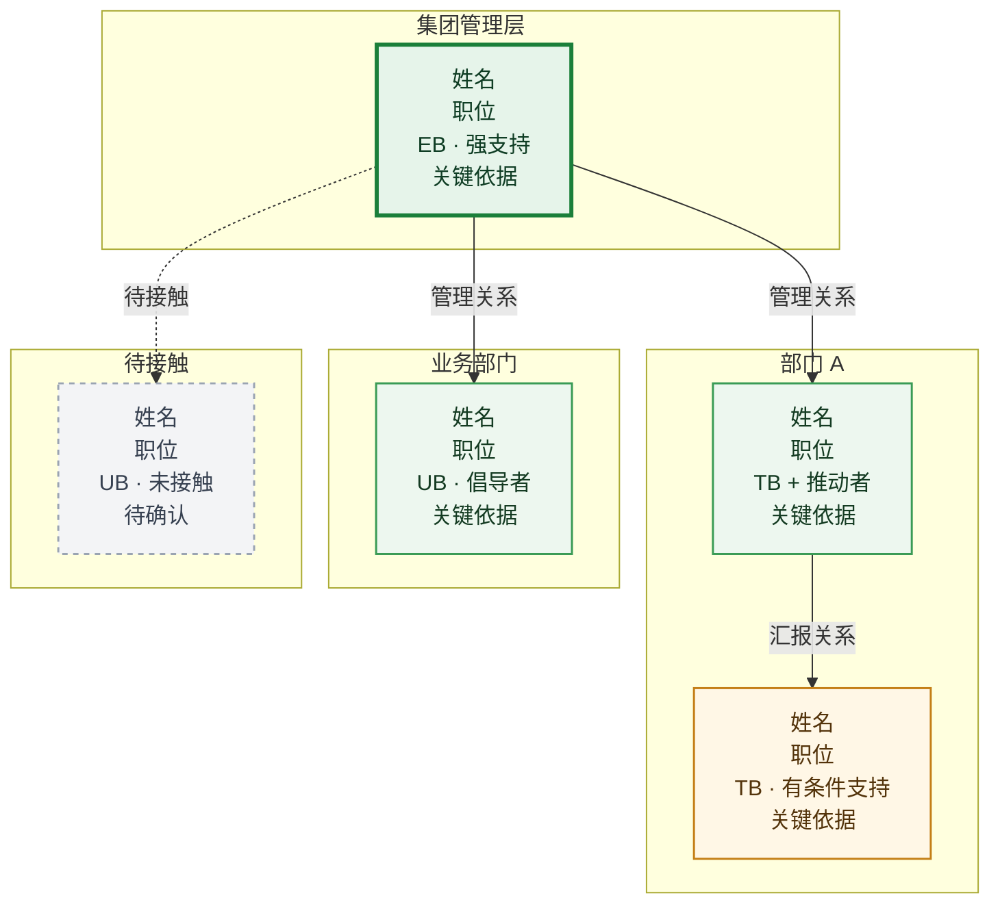
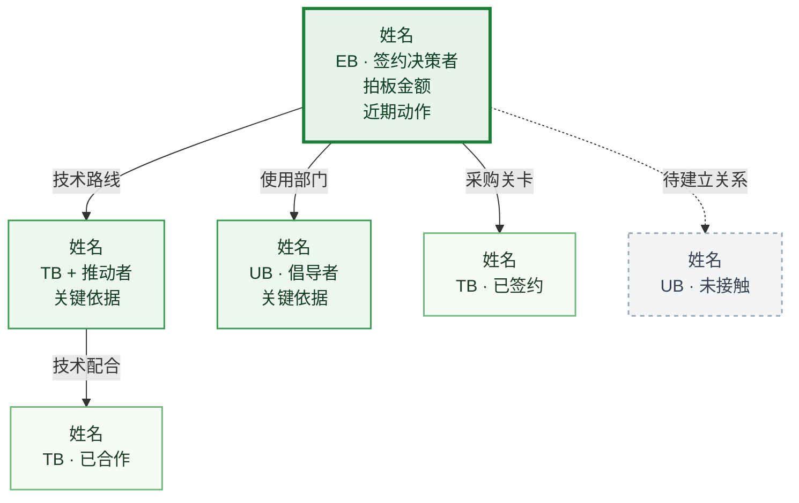

# 标准 ADP 输出模板

本文件是 `输出/客户名称-ADP.md` 的骨架模板。十段结构的定义和第五节子段要求见 `ADP方法论.md`。

````markdown
# <客户名称>

**一、客户简介**

待补充。

### 二、人员关系图谱

#### 人员关系图



关系总结：待补充。这里用一段话概括当前关键支持者、主要推动部门、待补位关系，以及这张关系图对后续经营动作的直接影响。

### 三、数字化现状

| 系统名称 | 系统类型 | 厂商 | 版本 / 规格 | 部署方式 | 业务对接人 | 使用痛点 |
|---|---|---|---|---|---|---|
| ... | ... | ... | ... | ... | ... | ... |

### 四、核心 KP 个人

姓名，职位，如何分析出来的。

### 五、决策链及客情关系分析

#### 决策链分析



#### 决策链客情分析

| 客户姓名 | 是否接触 | 决策力 / 客户关系 | 角色识别（可多选） | 对钉钉支持程度（客情等级积分） |
|---|---|---|---|---|
| ... | 是 / 否 | 决策力 + 客户关系进展 | EB / UB / TB / Coach | +3 强力推荐 / +2 指导行动 / +1 倾向我方 / 0 保持中立 / -1 倾向友商 / -2 负向引导 / -3 极力反对 / 待确认 |

#### 项目对接情况

按时间顺序记录首次对接、二次拜访、方案汇报、报价、跟进、宴请、客户反馈和下一步计划。

### 六、五大关键行为

记录 POC、高层拜访、总部参观、沙龙峰会、样板点参观的完成情况和近期规划。

### 七、近期规划（产品线）

| 计划时间 | 产品 | 对接部门 |
|---|---|---|
| ... | ... | ... |

### 八、已购买产品

以下仅填写客户已经购买的钉钉产品，不写其他厂商产品。

| 产品 | 购买范围 / 账号 | 使用部门 | 当前状态 |
|---|---|---|---|
| ... | ... | ... | ... |

### 九、客户群

**内部**

待补充。

**客户**

待补充。

**钉钉**

待补充。

### 十、风险&方案

待补充。
````

## 生成要求

- 每一节优先引用 `客户知识库/` 中已有内容。
- 一个客户只维护一份 `输出/客户名称-ADP.md`，后续持续迭代这份文档。
- 信息不足时在对应段落写"待确认"。
- 预算、成本、账号数、金额、日期、角色、项目阶段等高风险事实在生成前必须先回溯到原始资料或本轮最新工具结果核对，但最终 ADP 不展示来源信息。
- 高风险事实如果未核实，最终 ADP 统一写“待确认”，不要写“待回溯原始来源”这类溯源过程表述。
- 第二节关系图下方必须补一段总结性描述。
- 表格优先用于数字化现状、决策链客情分析、5KA、近期规划和风险。
- 不把公开资料、销售猜测、客户确认混写在同一种语气里。
- 有明确 PPL、销售目标、报价或推进中项目时，必须在 `客户知识库/机会与动机.md` 维护「机会质量五维评估」；最终 ADP 第七节不展开该表。
- 第五节「决策链客情分析」必须对照决策链上的每个人逐人评分，使用 `-3` 到 `+3` 的客情等级积分，并收口为 5 列简表。
- 最终 ADP 不输出任何 `来源`、`依据`、来源链接、页码、截图位置、来源文件名等溯源字段。
- Mermaid 图表只使用基础 `graph` / `flowchart` 语法；禁止使用 `quadrantChart`、`x-axis`、`y-axis` 等兼容性不稳定的新语法。
- 节点标签不使用 emoji、示例图标或 HTML 加粗；状态用文字标签和 `classDef` / `style` 表达。

## 图表规范

ADP 输出中以下两处必须附带 mermaid 可视化图表：

### 1. 人员关系图（第二节）

位置：「二、人员关系图谱」的「#### 人员关系图」子段。

类型：`graph TD` 或 `flowchart TD`（自顶向下组织结构图）。

规则：
- 按部门分 `subgraph`：集团管理层、各业务部门、待接触。
- 每个节点包含：姓名、职位、决策角色+客情积分/立场、关键依据（一句话）。
- EB 节点用绿色加粗（`stroke-width:3px`），放在最顶部。
- 已接触+强支持用绿色实线框，有条件支持用浅黄实线框，未接触用灰色虚线框，我方资源用蓝色实线框。
- 实线箭头 `-->` 表示直接管理/汇报关系，虚线箭头 `-.->` 表示待建立关系。
- 不单独增加图例图、线条示例图或 emoji 状态图标。
- 人员不足 3 人时可以省略图表，用纯文本列表代替。

### 2. 决策链分析（第五节）

位置：「五、决策链及客情关系分析」的「#### 决策链分析」子段。

类型：`graph TD` 或 `flowchart TD`（决策链树形图）。

规则：
- EB 居顶，按决策权流向向下展开。
- 每个节点标注：决策角色（EB/TB/UB/Coach）、客情积分/立场、一句话关键依据。
- 连线标注关系类型：管理、审批、技术把关、采购关卡。
- 样式与人员关系图一致（颜色对应客情状态），不要额外生成图例或示例线条。
- 人员不足 3 人时可以省略图表，用结构化文本列表代替。

## 客情等级积分规范

| 客情等级积分 | 活动空间 | 信息质量 | 立场程度 |
|---|---|---|---|
| -3 分 | 工作空间 | 将信息传递给友商 | 极力反对 |
| -2 分 | 工作空间 | 提供误导信息 | 负向引导 |
| -1 分 | 工作空间 | 提供公开信息 | 倾向友商 |
| 0 分 | 工作空间 | 提供公开信息 | 保持中立 |
| 1 分 | 社交空间 | 提供有效信息 | 倾向我方 |
| 2 分 | 半私人空间 | 被动提供私密信息 | 指导行动 |
| 3 分 | 私人空间 | 主动提供私密信息 | 强力推荐 |

评分要求：
- 决策链图上的每个人都必须进入评分表。
- 客情等级积分必须有活动空间、信息质量、立场程度或客户行为依据；证据不足写“待确认”。
- 有明确项目时，进展说明写「项目进展 + 客户关系进展」；没有明确项目时，写客户关系进展。
- 最终 ADP 输出时，把进展说明合并进「决策力 / 客户关系」列中，不额外扩成更多列。
