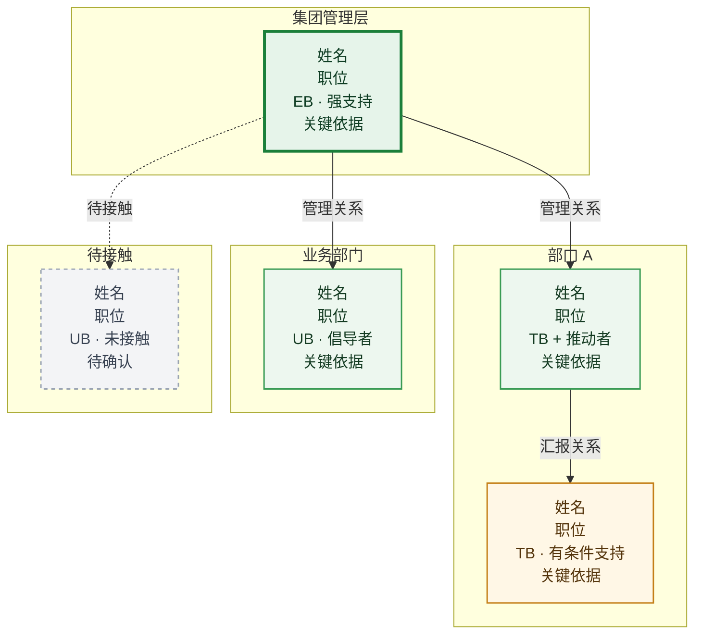
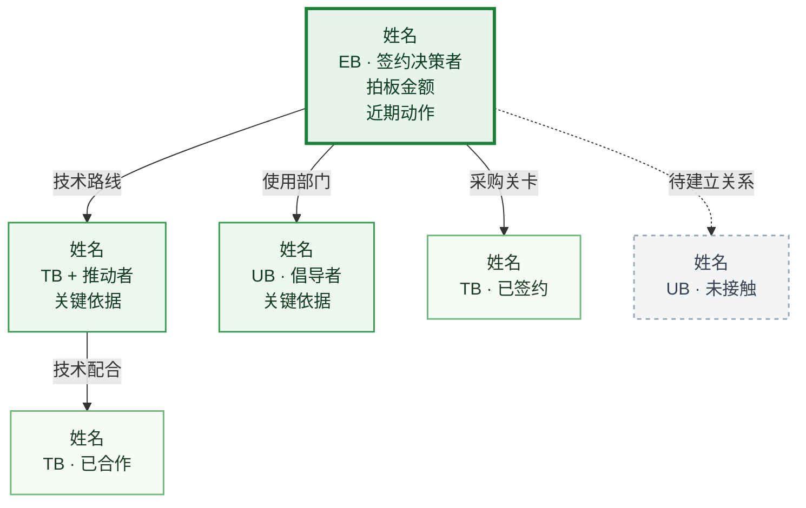

# <客户名称>

**一、客户简介**

待补充。

### 二、人员关系图谱

#### 人员关系图

关系总结：待补充。这里用一段话概括当前关键支持者、主要推动部门、待补位关系，以及这张关系图对后续经营动作的直接影响。

### 三、数字化现状

| 系统名称 | 系统类型 | 厂商 | 版本 / 规格 | 部署方式 | 业务对接人 | 使用痛点 |
|---|---|---|---|---|---|---|
| ... | ... | ... | ... | ... | ... | ... |

### 四、核心 KP 个人

姓名，职位，如何分析出来的。

### 五、决策链及客情关系分析

#### 决策链分析

#### 决策链客情分析

| 客户姓名 | 是否接触 | 决策力 / 客户关系 | 角色识别（可多选） | 对钉钉支持程度（客情等级积分） |
|---|---|---|---|---|
| ... | 是 / 否 | 决策力 + 客户关系进展 | EB / UB / TB / Coach | +3 强力推荐 / +2 指导行动 / +1 倾向我方 / 0 保持中立 / -1 倾向友商 / -2 负向引导 / -3 极力反对 / 待确认 |

#### 项目对接情况

按时间顺序记录首次对接、二次拜访、方案汇报、报价、跟进、宴请、客户反馈和下一步计划。

### 六、五大关键行为

记录 POC、高层拜访、总部参观、沙龙峰会、样板点参观的完成情况和近期规划。

### 七、近期规划（产品线）

| 计划时间 | 产品 | 对接部门 |
|---|---|---|
| ... | ... | ... |

### 八、已购买产品

以下仅填写客户已经购买的钉钉产品，不写其他厂商产品。

| 产品 | 购买范围 / 账号 | 使用部门 | 当前状态 |
|---|---|---|---|
| ... | ... | ... | ... |

### 九、客户群

**内部**

待补充。

**客户**

待补充。

**钉钉**

待补充。

### 十、风险&方案

待补充。
